---
# Natas Level 0

Username: natas0  
Password: natas0  
URL: http://natas0.natas.labs.overthewire.org
## Concept

**Basic HTML Source Code Inspection**

Sensitive information should never be stored in client-side HTML because users can easily inspect the page source.

## Walkthrough

After logging in, the webpage displays a message but does not directly show the password.

By viewing the page source:

- Right-click → View Page Source
    
- Or use browser developer tools
    

The password for the next level is found inside an HTML comment.
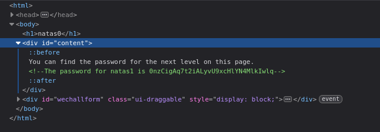
## Commands Used

Browser:

Right Click → View Page Source

Or:

Ctrl + U

## Hidden Password

<details> <summary><b>Password</b></summary>

0nzCigAq7t2iALyvU9xcHlYN4MlkIwlq

</details>

---

# Natas Level 1
## Concept

**Client-Side Restrictions Are Useless**

Right-click was disabled using JavaScript. However, client-side restrictions do not provide real security.

## Walkthrough

Even though right-click is disabled:

Use the browser URL bar:

view-source:http://natas1.natas.labs.overthewire.org/

The password is again inside an HTML comment.
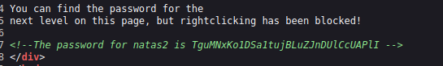
## Commands Used

view-source:http://natas1.natas.labs.overthewire.org/

## Hidden Password

<details> <summary><b>Password</b></summary>

TguMNxKo1DSa1tujBLuZJnDUlCcUAPlI

</details>

---

# Natas Level 2
## Concept

**Information Disclosure via Exposed Directories**

Developers sometimes leave sensitive files inside web-accessible directories.

## Walkthrough

Viewing the page source reveals:

```

```

Navigating to:

http://natas2.natas.labs.overthewire.org/files/

Reveals a file named `users.txt`.

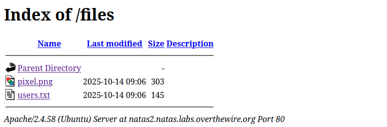

Inside `users.txt`:

```
natas3:3gqisGdR0pjm6tpkDKdIWO2hSvchLeYH
```

## Commands Used

`http://natas2.natas.labs.overthewire.org/files/`
## Hidden Password

<details> <summary><b>Password</b></summary>

3gqisGdR0pjm6tpkDKdIWO2hSvchLeYH

</details>

---
# Natas Level 3
## Concept

**Robots.txt Enumeration**

The `robots.txt` file may expose sensitive directories intended to be hidden from search engines.

## Walkthrough

Visit:

http://natas3.natas.labs.overthewire.org/robots.txt

Output:

Disallow: /s3cr3t/

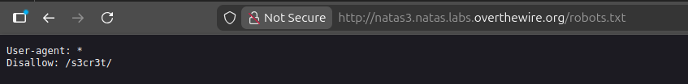

Navigate to:

/s3cr3t/user.txt

The password is inside that file.
## Commands Used

/robots.txt  
/s3cr3t/user.txt

## Hidden Password

<details> <summary><b>Password</b></summary>

QryZXc2e0zahULdHrtHxzyYkj59kUxLQ

</details>

---
# Natas Level 4
## Concept

**HTTP Referer Header Manipulation**

The application validates access based on the HTTP Referer header.

## Walkthrough

The server checks whether the request came from a specific page.

Using Burp Suite or curl, modify the Referer header:

Referer: http://natas5.natas.labs.overthewire.org/

Access is granted.

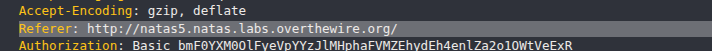
## Commands Used

Using curl:
```
curl -u natas4:<password> \  
-H "Referer: http://natas5.natas.labs.overthewire.org/" \  
http://natas4.natas.labs.overthewire.org/
```
## Hidden Password

<details> <summary><b>Password</b></summary>

0n35PkggAPm2zbEpOU802c0x0Msn1ToK

</details>

---
# Natas Level 5
## Concept

**Cookie Manipulation**

Authentication state stored in client-side cookies can be modified.
## Walkthrough

Inspect cookies in the browser.

Found:

`loggedin=0`

Change it to:

`loggedin=1`

Refresh the page. Access granted.

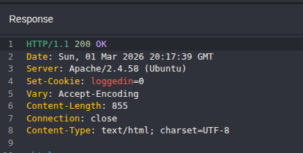

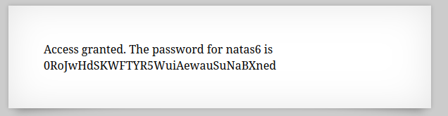

## Commands Used

Browser:

Developer Tools → Application → Cookies

Modify:

loggedin=1

## Hidden Password

<details> <summary><b>Password</b></summary>

0RoJwHdSKWFTYR5WuiAewauSuNaBXned

</details>

---

# Natas Level 6
## Concept

**Source Code Disclosure & Insecure Includes**

Sensitive data stored in included PHP files can be accessed if directory listing is possible.

## Walkthrough

Viewing source reveals:

include "includes/secret.inc";

Navigate to:

/includes/secret.inc

Secret found:

FOEIUWGHFEEUHOFUOIU

Submit this secret to obtain the password.

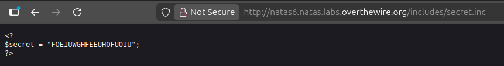

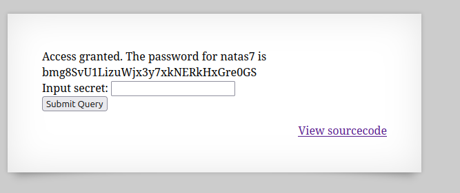

## Commands Used

/includes/secret.inc

## Hidden Password

<details> <summary><b>Password</b></summary>

bmg8SvU1LizuWjx3y7xkNERkHxGre0GS

</details>

---

# Natas Level 7
## Concept

**Local File Inclusion (LFI)**

User input is directly included in a file path.

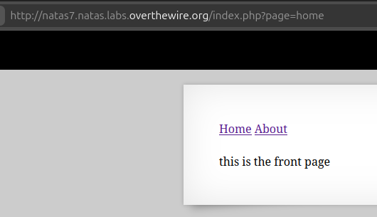

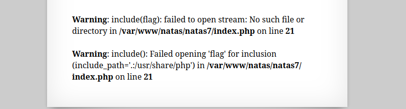

## Walkthrough

URL parameter:

index.php?page=home

The application includes the file specified in `page`.

The next password is located at:

/etc/natas_webpass/natas8

Exploit directory traversal:

index.php?page=/../../../../../../../../etc/natas_webpass/natas8

Password revealed.

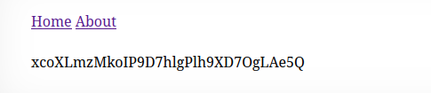

## Commands Used

?page=/../../../../../../../../etc/natas_webpass/natas8

## Hidden Password

<details> <summary><b>Password</b></summary>

xcoXLmzMkoIP9D7hlgPlh9XD7OgLAe5Q

</details>

---

# Natas Level 8
## Concept

**Reversing Custom Encoding**

The code uses:

bin2hex(strrev(base64_encode($secret)));

Reverse the process:

1. Hex decode
    
2. Reverse string
    
3. Base64 decode
	    
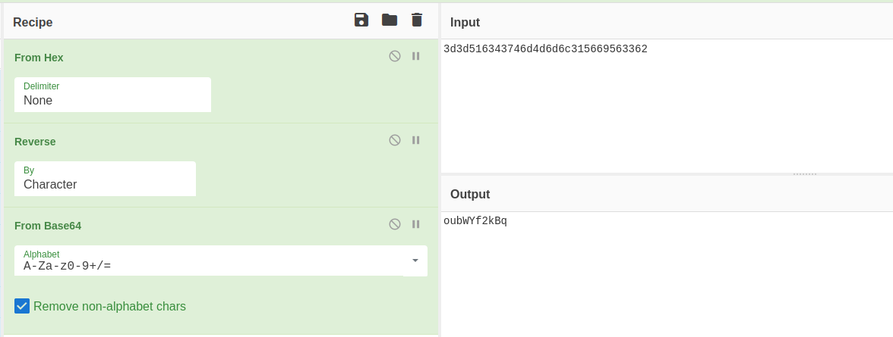

## Walkthrough

Encoded value:

3d3d516343746d4d6d6c315669563362

Steps:

echo 3d3d516343746d4d6d6c315669563362 | xxd -r -p  
rev  
base64 -d

Recovered secret:

oubWYf2kBq

Submit to retrieve password.

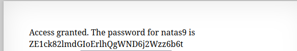

## Commands Used

echo 3d3d516343746d4d6d6c315669563362 | xxd -r -p | rev | base64 -d

## Hidden Password

<details> <summary><b>Password</b></summary>

ZE1ck82lmdGIoErlhQgWND6j2Wzz6b6t

</details>

---

# Natas Level 9
## Concept

**Command Injection**

User input is directly passed into a system command:

passthru("grep -i $key dictionary.txt");


## Walkthrough

Inject command:

| cat /etc/natas_webpass/natas10

Final command becomes:

grep -i  | cat /etc/natas_webpass/natas10 dictionary.txt

Password printed.

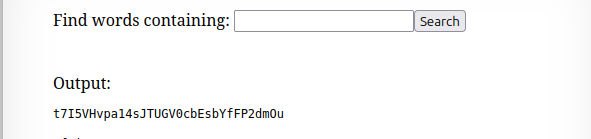

## Commands Used

| cat /etc/natas_webpass/natas10

## Hidden Password

<details> <summary><b>Password</b></summary>

t7I5VHvpa14sJTUGV0cbEsbYfFP2dmOu

</details>

---

# Natas Level 10
## Concept

**Command Injection with Blacklist Filtering**

Application filters:

; | &

But still vulnerable.

## Walkthrough

Payload:

.* /etc/natas_webpass/natas11

Command becomes:

grep -i .* /etc/natas_webpass/natas11 dictionary.txt

`grep` searches both files and prints the password.

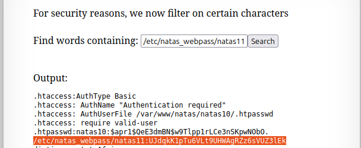
## Commands Used

.* /etc/natas_webpass/natas11

## Hidden Password

<details> <summary><b>Password</b></summary>

UJdqkK1pTu6VLt9UHWAgRZz6sVUZ3lEk

</details>

---
## 🧑‍💻 Author

Ghost -  Cyber-security Learner & CTF Player
